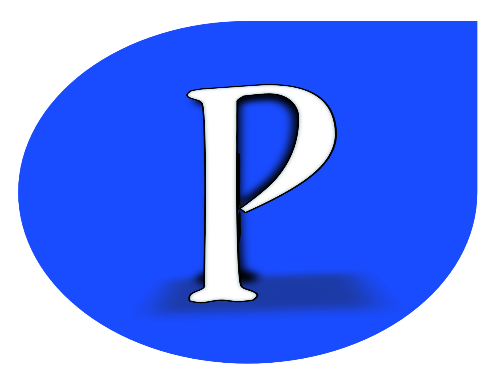

[](https://github.com/ellerbrock/open-source-badges/)


Peers is a website that helps Alx Students of software engineering learn better, faster and do hard stuffs easily with colleagues and peers of the same cohort and different cohorts

Peers features are;

- Learn: This is a feature that allows student to learn with colleagues and peers on different tasks
- Mentor: This is a feature where peers can register to mentor others on a particular concept they want to talk about and teach, when a mentor register to mentor, all members of peers gets notified of the new mentor session.
- Ask gpt: This feature allows members of peers to ask chat gpt for advice on anything relating to software engineering alone, anything aside that gpt won't respond with what they expect.
- Post: This features allows members to post questions, articles, react to posts and comments

## Contributing

<details>
<summary>
Steps
</summary>

- Star the repository


- Fork the repository


- Clone the forked repo to your local machine

```bash
git clone <url>
```

- Create a branch

```bash
git branch <branch name>
```

- Add your changes

- Create a pull request from your development branch

- Not sure of changes to make?

Check the Project section of the original repo for projects todo list or Click Goto Project below

[Goto Project](https://github.com/users/Ayobami6/projects/1)

or Goto Issues and choose any issues to fix

[Issues](https://github.com/Ayobami6/peers/issues)

</details>

## Project Setup

<details>
<summary>
Steps
</summary>

- Create a folder with name peers on your local machine

```bash
mkdir peers
cd peers
git clone <url> .
```

- Create virtual environment for linux and MacOX

```bash
python3 -m venv venv
```

- Activate venv

```bash
. venv/bin/activate
```

for Windows

```bash
> mkdir peers
> cd peers
> py -3 -m venv venv
```

Activate for Windows

```bash
venv\Scripts\activate
```

- Install all project dependecies

```bash
pip install -r requirements.txt
```

- Create `.env` file inside the root of peers to store your OpenAI Api

- Requesting the Postgresql database admin

Send an email [here](mailto:ayobamidele006@gmail.com) or Create and issue requesting it and specify changes to make or issues to fix

- Test the app from your local machine

Run

```bash
python manage.py runserver
```

Then open the generated port and host with your web browser with home endpoint

Like this

```
http://127.0.0.1:8000/home
```

If you encouter an issue setting up
create an Issue [here](https://github.com/Ayobami6/peers/issues)

</details>

### Keep Your Fork up to date

You can automatically keep your fork up to date by using [pull](https://github.com/wei/pull) by [@wei](https://github.com/wei/)

## Contributors

<a href="https://github.com/Ayobami6/peers/graphs/contributors">
  
</a>
